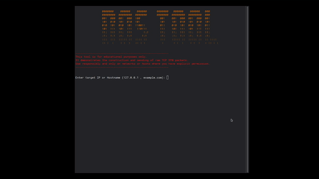

Multi-threaded SYN Flood Attacker (dos_tool)
---
### The tool performs a SYN Flood attack by manually constructing raw TCP packets with the SYN flag set.
* **Source IP and Port Spoofing:** The sender's IP and port are randomized for every packet to enhance anonymity and bypass simple filtering.
* **Raw Socket Access:** The application directly manipulates network packets at the IP layer.
* **Multi-threaded Operation:** Uses multiple threads to achieve a very high packet rate (packets per second).

**Disclaimer:** This tool is for educational purposes only. Use it responsibly and exclusively on networks or systems where you have explicit permission. Requires SUDO privileges to open raw sockets.
  
  ## Demo


## Installation

This project uses the standard C++ compiler (`g++`) and the **GNU Make** build system.

### Prerequisites

To successfully build this project on your system, you'll need:

* **Git**
* **GNU Make**
* **A C++ Compiler** (with C++17 support)

### Clone the Repository and Install

```bash
git clone https://github.com/ekkor13/dos_tool/
cd dos_tool
```bash
make
make install


***Launch***
dos_tool --help
